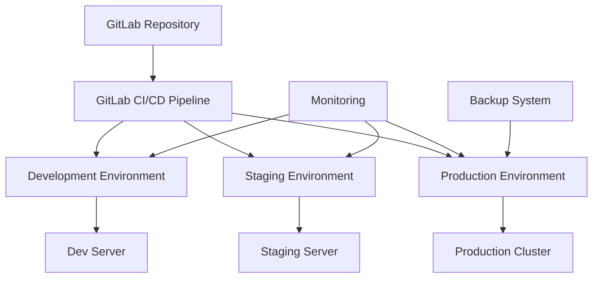

# Deployment Guide

Enterprise deployment guide for Ansible Inventory Management CLI in production environments.

## 🎯 Deployment Overview

This guide covers deploying the Ansible Inventory Management CLI across different environments with enterprise-grade practices:

- **Development** → Automatic deployment from `develop` branch
- **Staging** → Manual approval from `main` branch  
- **Production** → Manual approval with additional validation

## 🏗️ Architecture Overview



## 📋 Deployment Strategies

### 1. Development Environment

**Automatic deployment** triggered by commits to `develop` branch.

#### Configuration
```yaml
# .gitlab-ci.yml excerpt
deploy:development:
  stage: deploy
  environment:
    name: development
    url: https://dev.inventory.company.com
  script:
    - scp -r inventory/ $DEPLOY_USER@$DEPLOY_HOST:/opt/ansible-inventory/dev/
    - ssh $DEPLOY_USER@$DEPLOY_HOST "cd /opt/ansible-inventory/dev && python scripts/ansible_inventory_cli.py health"
  only:
    - develop
```

#### Server Setup
```bash
# Development server setup
sudo mkdir -p /opt/ansible-inventory/dev
sudo chown ansible-deploy:ansible-deploy /opt/ansible-inventory/dev

# Install dependencies
sudo apt update
sudo apt install -y python3 python3-pip ansible
pip3 install --user PyYAML pathlib2

# Configure service user
sudo useradd -m -s /bin/bash ansible-deploy
sudo usermod -aG sudo ansible-deploy
```

### 2. Staging Environment

**Manual deployment** with approval gates from `main` branch.

#### Configuration
```yaml
# .gitlab-ci.yml excerpt
deploy:staging:
  stage: deploy
  environment:
    name: staging
    url: https://staging.inventory.company.com
  when: manual
  script:
    - ansible-playbook -i staging-hosts.yml deploy-playbook.yml
    - ssh $DEPLOY_USER@$DEPLOY_HOST "cd /opt/ansible-inventory/staging && python scripts/ansible_inventory_cli.py validate"
  only:
    - main
```

#### Ansible Deployment Playbook
```yaml
# deploy-playbook.yml
---
- name: Deploy Ansible Inventory CLI to Staging
  hosts: staging_servers
  become: yes
  vars:
    app_dir: /opt/ansible-inventory/staging
    service_user: ansible-deploy
    
  tasks:
    - name: Create application directory
      file:
        path: "{{ app_dir }}"
        state: directory
        owner: "{{ service_user }}"
        group: "{{ service_user }}"
        mode: '0755'
    
    - name: Copy application files
      synchronize:
        src: "{{ playbook_dir }}/"
        dest: "{{ app_dir }}/"
        delete: yes
        recursive: yes
        rsync_opts:
          - "--exclude=.git"
          - "--exclude=venv"
          - "--exclude=__pycache__"
    
    - name: Install Python dependencies
      pip:
        requirements: "{{ app_dir }}/requirements.txt"
        virtualenv: "{{ app_dir }}/venv"
        virtualenv_python: python3
      become_user: "{{ service_user }}"
    
    - name: Run health check
      command: "{{ app_dir }}/venv/bin/python {{ app_dir }}/scripts/ansible_inventory_cli.py health"
      become_user: "{{ service_user }}"
      register: health_check
    
    - name: Display health check results
      debug:
        var: health_check.stdout
```

### 3. Production Environment

**Manual deployment** with extensive validation and rollback capability.

#### Blue-Green Deployment Strategy

```bash
#!/bin/bash
# deploy-production.sh

set -euo pipefail

BLUE_DIR="/opt/ansible-inventory/production-blue"
GREEN_DIR="/opt/ansible-inventory/production-green"
CURRENT_LINK="/opt/ansible-inventory/production"
BACKUP_DIR="/opt/ansible-inventory/backups/$(date +%Y%m%d_%H%M%S)"

# Determine current and target environments
if [ -L "$CURRENT_LINK" ] && [ "$(readlink $CURRENT_LINK)" = "$BLUE_DIR" ]; then
    CURRENT_ENV="blue"
    TARGET_ENV="green"
    TARGET_DIR="$GREEN_DIR"
else
    CURRENT_ENV="green"
    TARGET_ENV="blue"
    TARGET_DIR="$BLUE_DIR"
fi

echo "🔄 Deploying to $TARGET_ENV environment"

# Create backup
echo "📦 Creating backup..."
mkdir -p "$(dirname $BACKUP_DIR)"
if [ -d "$CURRENT_LINK" ]; then
    cp -r "$CURRENT_LINK" "$BACKUP_DIR"
fi

# Deploy to target environment
echo "🚀 Deploying application..."
rsync -av --delete \
    --exclude='.git' \
    --exclude='venv' \
    --exclude='__pycache__' \
    ./ "$TARGET_DIR/"

# Install dependencies
echo "📦 Installing dependencies..."
cd "$TARGET_DIR"
python3 -m venv venv
source venv/bin/activate
pip install -r requirements.txt

# Run validation
echo "✅ Running validation..."
python scripts/ansible_inventory_cli.py validate
python scripts/ansible_inventory_cli.py health

# Switch traffic
echo "🔀 Switching traffic to $TARGET_ENV..."
ln -sfn "$TARGET_DIR" "$CURRENT_LINK"

# Verify deployment
echo "🏥 Verifying deployment..."
sleep 5
python "$CURRENT_LINK/scripts/ansible_inventory_cli.py" health

echo "✅ Deployment to $TARGET_ENV completed successfully!"
echo "📝 Previous environment: $CURRENT_ENV"
echo "💾 Backup location: $BACKUP_DIR"
```

## 🔧 Infrastructure Setup

### Server Requirements

#### Minimum Production Requirements
- **CPU**: 2 cores
- **Memory**: 4GB RAM
- **Storage**: 20GB SSD
- **Network**: 1Gbps
- **OS**: Ubuntu 20.04 LTS or CentOS 8

#### Recommended Production Requirements
- **CPU**: 4+ cores
- **Memory**: 8GB+ RAM
- **Storage**: 100GB+ SSD
- **Network**: 10Gbps
- **OS**: Ubuntu 22.04 LTS

### Load Balancer Configuration

#### HAProxy Configuration
```
# /etc/haproxy/haproxy.cfg
global
    daemon
    log stdout local0

defaults
    mode http
    timeout connect 5000ms
    timeout client 50000ms
    timeout server 50000ms

frontend ansible_inventory_frontend
    bind *:80
    bind *:443 ssl crt /etc/ssl/certs/company.pem
    redirect scheme https if !{ ssl_fc }
    default_backend ansible_inventory_backend

backend ansible_inventory_backend
    balance roundrobin
    option httpchk GET /health
    server prod1 10.0.1.10:8080 check
    server prod2 10.0.1.11:8080 check
```

#### Nginx Configuration
```nginx
# /etc/nginx/sites-available/ansible-inventory
upstream ansible_inventory {
    server 10.0.1.10:8080;
    server 10.0.1.11:8080;
}

server {
    listen 80;
    server_name inventory.company.com;
    return 301 https://$server_name$request_uri;
}

server {
    listen 443 ssl http2;
    server_name inventory.company.com;
    
    ssl_certificate /etc/ssl/certs/company.crt;
    ssl_certificate_key /etc/ssl/private/company.key;
    
    location /health {
        proxy_pass http://ansible_inventory;
        proxy_set_header Host $host;
        proxy_set_header X-Real-IP $remote_addr;
    }
    
    location / {
        proxy_pass http://ansible_inventory;
        proxy_set_header Host $host;
        proxy_set_header X-Real-IP $remote_addr;
        proxy_set_header X-Forwarded-For $proxy_add_x_forwarded_for;
        proxy_set_header X-Forwarded-Proto $scheme;
    }
}
```

### Database & Storage

#### File System Layout
```
/opt/ansible-inventory/
├── production/              # Current production (symlink)
├── production-blue/         # Blue environment
├── production-green/        # Green environment
├── backups/                 # Deployment backups
│   ├── 20240630_143022/
│   └── 20240629_091505/
├── shared/                  # Shared data
│   ├── inventory_source/    # Master CSV files
│   ├── logs/               # Centralized logs
│   └── config/             # Environment configs
└── scripts/                # Deployment scripts
    ├── deploy.sh
    ├── rollback.sh
    └── health-check.sh
```

#### Backup Strategy
```bash
#!/bin/bash
# backup-system.sh

BACKUP_ROOT="/opt/ansible-inventory/backups"
RETENTION_DAYS=30

# Create daily backup
DATE=$(date +%Y%m%d_%H%M%S)
BACKUP_DIR="$BACKUP_ROOT/daily/$DATE"

mkdir -p "$BACKUP_DIR"

# Backup application
tar -czf "$BACKUP_DIR/application.tar.gz" \
    -C /opt/ansible-inventory/production \
    --exclude=venv \
    --exclude=__pycache__ \
    .

# Backup data
cp -r /opt/ansible-inventory/shared/inventory_source "$BACKUP_DIR/"
cp -r /opt/ansible-inventory/shared/logs "$BACKUP_DIR/"

# Cleanup old backups
find "$BACKUP_ROOT/daily" -type d -mtime +$RETENTION_DAYS -exec rm -rf {} +

echo "✅ Backup completed: $BACKUP_DIR"
```

## 🔐 Security Configuration

### SSL/TLS Setup
```bash
# Generate SSL certificate (Let's Encrypt)
sudo apt install certbot python3-certbot-nginx
sudo certbot --nginx -d inventory.company.com

# Or use company certificate
sudo cp company.crt /etc/ssl/certs/
sudo cp company.key /etc/ssl/private/
sudo chmod 600 /etc/ssl/private/company.key
```

### Firewall Configuration
```bash
# UFW configuration
sudo ufw default deny incoming
sudo ufw default allow outgoing
sudo ufw allow ssh
sudo ufw allow 80/tcp
sudo ufw allow 443/tcp
sudo ufw enable

# Allow specific IPs for management
sudo ufw allow from 10.0.0.0/8 to any port 22
```

### Service Account Setup
```bash
# Create dedicated service account
sudo useradd -r -s /bin/false -d /opt/ansible-inventory ansible-inventory
sudo usermod -aG ansible-inventory ansible-deploy

# Set up SSH keys for deployment
sudo -u ansible-deploy ssh-keygen -t ed25519 -f ~/.ssh/deploy_key
# Add public key to GitLab Deploy Keys
```

## 📊 Monitoring & Observability

### Health Monitoring
```bash
#!/bin/bash
# health-monitor.sh

LOG_FILE="/var/log/ansible-inventory-health.log"
HEALTH_THRESHOLD=80

# Run health check
HEALTH_OUTPUT=$(python /opt/ansible-inventory/production/scripts/ansible_inventory_cli.py health --output-format json)
HEALTH_SCORE=$(echo "$HEALTH_OUTPUT" | jq -r '.health_score')

# Log result
echo "$(date): Health score: $HEALTH_SCORE%" >> "$LOG_FILE"

# Alert if below threshold
if [ "$HEALTH_SCORE" -lt "$HEALTH_THRESHOLD" ]; then
    echo "⚠️ ALERT: Health score $HEALTH_SCORE% below threshold $HEALTH_THRESHOLD%" >> "$LOG_FILE"
    
    # Send alert (customize for your notification system)
    curl -X POST "$SLACK_WEBHOOK_URL" \
        -H 'Content-type: application/json' \
        -d "{\"text\":\"🚨 Ansible Inventory health score: $HEALTH_SCORE%\"}"
fi
```

### Application Metrics
```python
#!/usr/bin/env python3
# metrics-collector.py

import json
import time
import subprocess
from datetime import datetime

def collect_metrics():
    """Collect application metrics."""
    metrics = {
        'timestamp': datetime.now().isoformat(),
        'health': {},
        'performance': {},
        'system': {}
    }
    
    # Health metrics
    try:
        result = subprocess.run([
            'python', '/opt/ansible-inventory/production/scripts/ansible_inventory_cli.py',
            'health', '--output-format', 'json'
        ], capture_output=True, text=True, timeout=30)
        
        if result.returncode == 0:
            metrics['health'] = json.loads(result.stdout)
    except Exception as e:
        metrics['health']['error'] = str(e)
    
    # Performance metrics
    start_time = time.time()
    try:
        subprocess.run([
            'python', '/opt/ansible-inventory/production/scripts/ansible_inventory_cli.py',
            'health'
        ], capture_output=True, timeout=30)
        metrics['performance']['health_check_duration'] = time.time() - start_time
    except Exception as e:
        metrics['performance']['error'] = str(e)
    
    return metrics

if __name__ == "__main__":
    metrics = collect_metrics()
    print(json.dumps(metrics, indent=2))
    
    # Send to monitoring system (customize as needed)
    # send_to_prometheus(metrics)
    # send_to_datadog(metrics)
```

### Log Aggregation
```yaml
# filebeat.yml
filebeat.inputs:
- type: log
  enabled: true
  paths:
    - /opt/ansible-inventory/shared/logs/*.log
  fields:
    service: ansible-inventory
    environment: production
  fields_under_root: true

output.elasticsearch:
  hosts: ["elasticsearch.company.com:9200"]
  index: "ansible-inventory-%{+yyyy.MM.dd}"

logging.level: info
logging.to_files: true
logging.files:
  path: /var/log/filebeat
  name: filebeat
  keepfiles: 7
```

## 🔄 Maintenance & Operations

### Rolling Updates
```bash
#!/bin/bash
# rolling-update.sh

SERVERS=("prod1.company.com" "prod2.company.com")
UPDATE_SCRIPT="/opt/ansible-inventory/scripts/update.sh"

for server in "${SERVERS[@]}"; do
    echo "🔄 Updating $server..."
    
    # Remove from load balancer
    ssh "$server" "sudo systemctl stop nginx"
    
    # Update application
    ssh "$server" "$UPDATE_SCRIPT"
    
    # Verify health
    ssh "$server" "python /opt/ansible-inventory/production/scripts/ansible_inventory_cli.py health"
    
    if [ $? -eq 0 ]; then
        # Add back to load balancer
        ssh "$server" "sudo systemctl start nginx"
        echo "✅ $server updated successfully"
    else
        echo "❌ $server update failed"
        exit 1
    fi
    
    # Wait before next server
    sleep 30
done

echo "✅ Rolling update completed"
```

### Disaster Recovery
```bash
#!/bin/bash
# disaster-recovery.sh

BACKUP_LOCATION="/opt/ansible-inventory/backups"
RECOVERY_TARGET="/opt/ansible-inventory/recovery"

# Stop services
sudo systemctl stop nginx
sudo systemctl stop ansible-inventory

# Restore from latest backup
LATEST_BACKUP=$(ls -t "$BACKUP_LOCATION"/daily/ | head -1)
echo "📦 Restoring from backup: $LATEST_BACKUP"

mkdir -p "$RECOVERY_TARGET"
tar -xzf "$BACKUP_LOCATION/daily/$LATEST_BACKUP/application.tar.gz" -C "$RECOVERY_TARGET"

# Restore data
cp -r "$BACKUP_LOCATION/daily/$LATEST_BACKUP/inventory_source" /opt/ansible-inventory/shared/

# Switch to recovery
ln -sfn "$RECOVERY_TARGET" /opt/ansible-inventory/production

# Start services
sudo systemctl start ansible-inventory
sudo systemctl start nginx

echo "✅ Disaster recovery completed"
```

## 📞 Support & Escalation

### Runbook for Common Issues

#### 1. Health Score Below Threshold
```bash
# Check application logs
tail -100 /opt/ansible-inventory/shared/logs/audit.log

# Run detailed health check
python /opt/ansible-inventory/production/scripts/ansible_inventory_cli.py health --verbose

# Check system resources
df -h
free -h
top -p $(pgrep -f ansible_inventory_cli)
```

#### 2. Deployment Failure
```bash
# Rollback to previous version
/opt/ansible-inventory/scripts/rollback.sh

# Check deployment logs
tail -100 /var/log/ansible-inventory-deploy.log

# Verify system state
systemctl status nginx
systemctl status ansible-inventory
```

#### 3. Performance Issues
```bash
# Profile application
python -m cProfile -o /tmp/profile.stats \
    /opt/ansible-inventory/production/scripts/ansible_inventory_cli.py health

# Check network connectivity
ping gitlab.company.com
curl -I https://inventory.company.com/health
```

### Escalation Matrix

| Severity | Response Time | Escalation |
|----------|---------------|------------|
| **Critical** (Service Down) | 15 minutes | On-call engineer → Manager |
| **High** (Performance Issues) | 1 hour | DevOps team → Senior engineer |
| **Medium** (Feature Issues) | 4 hours | Product team → Development |
| **Low** (Enhancement) | Next business day | Backlog review |

### Emergency Contacts

```yaml
# emergency-contacts.yml
contacts:
  primary_oncall:
    name: "DevOps On-Call"
    phone: "+1-555-0123"
    slack: "#devops-alerts"
    
  backup_oncall:
    name: "Senior Engineer"
    phone: "+1-555-0456"
    email: "senior.engineer@company.com"
    
  management:
    name: "Engineering Manager"
    phone: "+1-555-0789"
    email: "eng.manager@company.com"

escalation_procedures:
  - step: 1
    action: "Contact primary on-call"
    timeout: "15 minutes"
    
  - step: 2
    action: "Contact backup on-call"
    timeout: "30 minutes"
    
  - step: 3
    action: "Contact management"
    timeout: "1 hour"
```

---

**Ready for production? Start with the [Installation Guide](installation.md) and follow the deployment checklist above! 🚀** 