# GitLab CI/CD Pipeline Implementation

Complete guide for implementing enterprise-grade CI/CD pipeline for Ansible Inventory Management using GitLab.

## 🏗️ Pipeline Overview

The GitLab CI/CD pipeline provides:
- **Multi-stage validation** with parallel execution
- **Security scanning** and vulnerability assessment  
- **Code quality checks** with automated formatting
- **Multi-Python version testing** (3.7-3.12)
- **Ansible-specific validation** and health checks
- **Automated deployment** with environment promotion
- **Performance monitoring** and reporting

## 📋 Pipeline Stages

```mermaid
graph LR
    A[🔍 Validate] --> B[🧪 Test]
    A --> C[🔒 Security]
    A --> D[📊 Quality]
    B --> E[🐋 Build]
    C --> E
    D --> E
    E --> F[🚀 Deploy Dev]
    F --> G[🎯 Deploy Staging]
    G --> H[🏢 Deploy Production]
```



### Stage 1: Validation (`validate`)
- **Code formatting** checks (Black, isort)
- **Linting** (flake8, mypy, yamllint)
- **Pre-commit hooks** validation
- **Dependency scanning**

### Stage 2: Testing (`test`)
- **Unit tests** with coverage reporting
- **Integration tests** with real Ansible
- **Multi-Python versions** (3.7, 3.8, 3.9, 3.10, 3.11, 3.12)
- **Performance benchmarks**

### Stage 3: Security (`security`)
- **Static analysis** (Bandit)
- **Dependency vulnerabilities** (Safety)
- **Secret scanning** (GitLab Secret Detection)
- **Container scanning** (if using Docker)

### Stage 4: Quality (`quality`)
- **Code coverage** analysis
- **Complexity metrics** 
- **Documentation validation**
- **Ansible best practices** check

### Stage 5: Build (`build`)
- **Package creation** (wheel, source)
- **Docker image** building (optional)
- **Artifact collection**

### Stage 6: Deploy (`deploy`)
- **Development** environment (automatic)
- **Staging** environment (manual approval)
- **Production** environment (manual approval + additional checks)

## 🔧 Implementation Guide

### 1. GitLab CI/CD Configuration

Create `.gitlab-ci.yml` in project root:

```yaml
# See full implementation in .gitlab-ci.yml
```

### 2. Required GitLab Variables

Configure these in **Settings > CI/CD > Variables**:

#### Required Variables
| Variable | Description | Type | Example |
|----------|-------------|------|---------|
| `ANSIBLE_VAULT_PASSWORD` | Ansible vault password | Masked | `secure_password_123` |
| `DEPLOY_SSH_KEY` | SSH key for deployments | File | Private key content |
| `REGISTRY_USERNAME` | Docker registry username | Protected | `deployer` |
| `REGISTRY_PASSWORD` | Docker registry password | Masked | `secure_token` |

#### Optional Variables
| Variable | Description | Default | Example |
|----------|-------------|---------|---------|
| `PYTHON_DEFAULT_VERSION` | Default Python version | `3.10` | `3.11` |
| `COVERAGE_THRESHOLD` | Minimum coverage % | `80` | `85` |
| `DEPLOY_ENVIRONMENT` | Target environment | `development` | `production` |

### 3. GitLab Runner Configuration

#### Shared Runners
For most projects, GitLab.com shared runners work well:
```yaml
# Use shared runners with Docker executor
image: python:3.10-slim
```

#### Self-Hosted Runners
For enterprise environments:

```toml
# /etc/gitlab-runner/config.toml
[[runners]]
  name = "ansible-inventory-runner"
  url = "https://gitlab.com/"
  token = "YOUR_RUNNER_TOKEN"
  executor = "docker"
  [runners.docker]
    image = "python:3.10-slim"
    privileged = false
    volumes = ["/cache", "/var/run/docker.sock:/var/run/docker.sock"]
```

### 4. Pipeline Configuration Files

#### Cache Configuration
```yaml
cache:
  key: ${CI_COMMIT_REF_SLUG}
  paths:
    - .cache/pip
    - .venv/
    - node_modules/
```

#### Artifacts Strategy
```yaml
artifacts:
  when: always
  expire_in: 30 days
  reports:
    coverage: coverage.xml
    junit: test-results.xml
  paths:
    - htmlcov/
    - dist/
    - reports/
```

## 🚀 Advanced Features

### 1. Parallel Matrix Testing

```yaml
test:python-matrix:
  stage: test
  parallel:
    matrix:
      - PYTHON_VERSION: ["3.7", "3.8", "3.9", "3.10", "3.11", "3.12"]
  image: python:${PYTHON_VERSION}-slim
  script:
    - make test-cov
```

### 2. Dynamic Environment Creation

```yaml
deploy:review:
  stage: deploy
  environment:
    name: review/$CI_COMMIT_REF_NAME
    url: https://$CI_COMMIT_REF_SLUG.example.com
    on_stop: stop:review
  only:
    - merge_requests
```

### 3. Approval Workflows

```yaml
deploy:production:
  stage: deploy
  environment:
    name: production
  when: manual
  only:
    - main
  before_script:
    - echo "Deploying to production requires manual approval"
```

### 4. Performance Monitoring

```yaml
performance:
  stage: test
  script:
    - python -m pytest tests/performance/ --benchmark-json=benchmark.json
  artifacts:
    reports:
      performance: benchmark.json
```

## 📊 Quality Gates

### Code Coverage
```yaml
# Fail if coverage below threshold
coverage: '/TOTAL.*\s+(\d+%)$/'
coverage_threshold: 80
```

### Security Scanning
```yaml
# Security scan with GitLab Security Dashboard
include:
  - template: Security/SAST.gitlab-ci.yml
  - template: Security/Secret-Detection.gitlab-ci.yml
  - template: Security/Dependency-Scanning.gitlab-ci.yml
```

### Code Quality
```yaml
code_quality:
  stage: quality
  image: docker:stable
  services:
    - docker:stable-dind
  script:
    - docker run --env SOURCE_CODE="$PWD" 
                 --volume "$PWD":/code 
                 --volume /var/run/docker.sock:/var/run/docker.sock 
                 "registry.gitlab.com/gitlab-org/ci-cd/codequality:latest" /code
  artifacts:
    reports:
      codequality: gl-code-quality-report.json
```

## 🔒 Security Best Practices

### 1. Secret Management
```yaml
# Use GitLab CI/CD variables for secrets
before_script:
  - export ANSIBLE_VAULT_PASSWORD_FILE=<(echo "$ANSIBLE_VAULT_PASSWORD")
```

### 2. Least Privilege Access
```yaml
# Limit variable scope
variables:
  ENVIRONMENT: "development"
  # Use protected variables for production
```

### 3. Security Scanning
```yaml
security:bandit:
  stage: security
  script:
    - bandit -r scripts/ -f json -o bandit-report.json
    - bandit -r scripts/ -f txt
  artifacts:
    reports:
      sast: bandit-report.json
```

## 🎯 Deployment Strategies

### 1. Blue-Green Deployment
```yaml
deploy:blue-green:
  stage: deploy
  script:
    - scripts/deploy-blue-green.sh
  environment:
    name: production
    url: $PRODUCTION_URL
```

### 2. Canary Deployment  
```yaml
deploy:canary:
  stage: deploy
  script:
    - scripts/deploy-canary.sh 10%  # 10% traffic
  when: manual
```

### 3. Rolling Updates
```yaml
deploy:rolling:
  stage: deploy
  script:
    - ansible-playbook -i inventory/production.yml playbooks/rolling-update.yml
```

## 📈 Monitoring & Observability

### 1. Pipeline Metrics
- **Build duration** tracking
- **Success/failure rates** 
- **Test coverage** trends
- **Security scan** results

### 2. Application Health
```yaml
health-check:
  stage: verify
  script:
    - python scripts/ansible_inventory_cli.py health --output-format json > health.json
  artifacts:
    reports:
      junit: health.json
```

### 3. Performance Tracking
```yaml
performance:
  stage: test
  script:
    - time python scripts/ansible_inventory_cli.py health
    - python scripts/performance-benchmark.py
```

## 🚨 Troubleshooting

### Common Issues

#### 1. **Pipeline Stuck in Pending**
```bash
# Check runner availability
gitlab-runner list
gitlab-runner verify
```

#### 2. **Cache Not Working**
```yaml
# Clear cache
cache:
  key: ${CI_COMMIT_REF_SLUG}
  policy: pull-push  # Use pull-push policy
```

#### 3. **Timeout Issues**
```yaml
# Increase timeout
timeout: 3h
```

#### 4. **Artifact Upload Failures**
```yaml
# Check artifact size limits
artifacts:
  expire_in: 1 day  # Reduce expiry
```

### Debug Mode
```yaml
# Enable debug logging
variables:
  CI_DEBUG_TRACE: "true"
```

## 📚 Best Practices

### 1. **Pipeline Efficiency**
- Use `needs:` for job dependencies
- Implement smart caching strategies
- Parallel job execution where possible
- Fail fast on critical errors

### 2. **Security**
- Never commit secrets to repository
- Use protected variables for sensitive data
- Implement security scanning in every pipeline
- Regular dependency updates

### 3. **Maintainability**
- Use YAML anchors for reusable configurations
- Implement pipeline templates
- Clear job naming conventions
- Comprehensive artifact management

### 4. **Monitoring**
- Set up alerts for pipeline failures
- Monitor deployment success rates
- Track performance regression
- Regular pipeline health reviews

## 🔗 Related Resources

- [GitLab CI/CD Documentation](https://docs.gitlab.com/ee/ci/)
- [GitLab Security Scanning](https://docs.gitlab.com/ee/user/application_security/)
- [Ansible CI/CD Best Practices](https://docs.ansible.com/ansible/latest/dev_guide/testing_integration.html)
- [Docker in GitLab CI](https://docs.gitlab.com/ee/ci/docker/)

---

**Next Steps:**
1. Review the [full .gitlab-ci.yml implementation](../.gitlab-ci.yml)
2. Configure required GitLab variables
3. Set up runners (if using self-hosted)
4. Test the pipeline with a merge request 