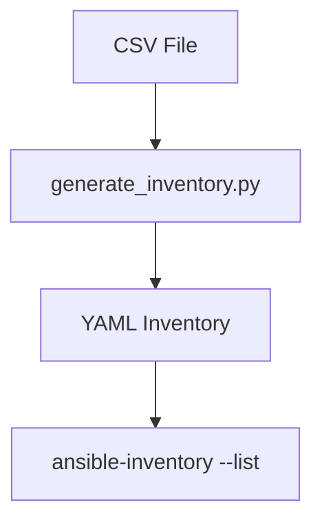

# Inventory Generator

Welcome to the Inventory Generator. It converts CSV host data into YAML inventories that Ansible understands.
The workflow targets Red Hat Enterprise Linux 9 (RHEL 9) and GitLab Runner environments.

## Quickstart

```bash
# Install dependencies on RHEL 9
sudo dnf install -y python3.11 python3.11-pip ansible-core git

# Clone and enter the repository
git clone https://example.com/ansible-inventory-cli.git
cd ansible-inventory-cli

# Create a virtual environment
python3.11 -m venv venv
source venv/bin/activate
pip install -r requirements.txt

# Generate the inventory from CSV
python scripts/ansible_inventory_cli.py generate
```

The output YAML files appear in the `inventory/` directory.
See [installation](installation.md) for setup and [usage](usage.md) for command examples.


