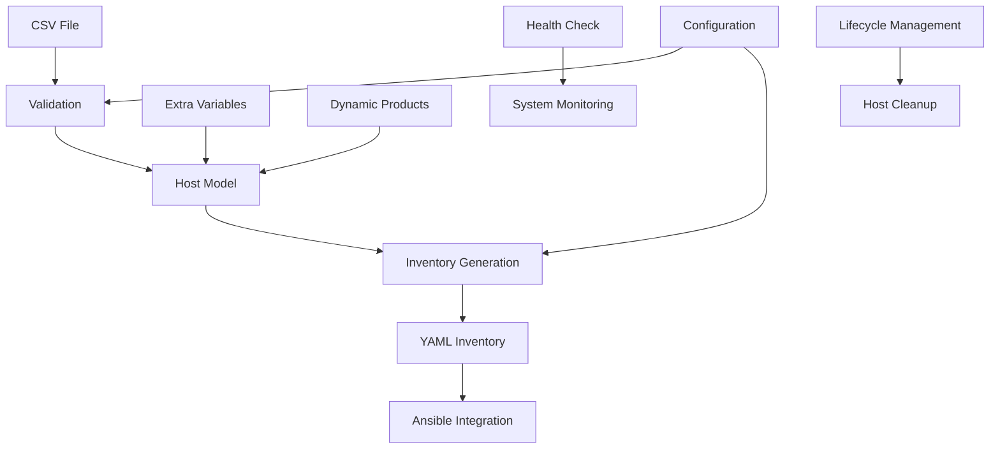

# Ansible Inventory Management System

Welcome to the Ansible Inventory Management System. This powerful tool converts CSV host data into structured YAML inventories that Ansible understands, with support for dynamic product columns, extra variables, and comprehensive lifecycle management.

## 🚀 Quick Start

```bash
# Install dependencies
sudo dnf install -y python3.11 python3.11-pip ansible-core git

# Clone and enter the repository
git clone https://example.com/ansible-inventory-cli.git
cd ansible-inventory-cli

# Create a virtual environment
python3.11 -m venv venv
source venv/bin/activate
pip install -r requirements.txt

# Copy configuration
cp inventory-config.yml.example inventory-config.yml

# Generate the inventory from CSV
python3 scripts/ansible_inventory_cli.py generate
```

The output YAML files appear in the `inventory/` directory.

## 📚 Documentation

### Core Documentation
- **[CSV Format Reference](csv_format.md)** - Complete guide to CSV structure and columns
- **[Configuration Guide](configuration.md)** - How to configure the system
- **[Usage Guide](usage.md)** - Comprehensive command reference and examples
- **[Installation Guide](installation.md)** - Setup and installation instructions

### Additional Resources
- **[FAQ](faq.md)** - Frequently asked questions
- **[Contributing](contributing.md)** - How to contribute to the project
- **[CI/CD Guide](ci.md)** - Continuous integration setup

## ✨ Key Features

### 🔄 Dynamic Product Columns
Support for flexible product definitions with unlimited product columns:
- `product_1`, `product_2`, `product_3`, etc.
- Automatic group creation for each product
- Multiple products per host
- No CSV parsing issues

### 📊 Extra Variables (Metadata)
Any CSV column not in the standard list becomes an extra variable:
- Automatically stored in host metadata
- Accessible in Ansible playbooks
- No configuration required
- Flexible and extensible

### 🏗️ Comprehensive Group Structure
Automatic creation of logical groups:
- **Application Groups**: `app_web_server`, `app_api_server`
- **Product Groups**: `product_web`, `product_api`, `product_analytics`
- **Environment Groups**: `env_production`, `env_development`
- **Site Groups**: `site_use1`, `site_usw2`
- **Dashboard Groups**: `dashboard_web_servers`

### 🔧 Enterprise Features
- **Patch Management**: Batch windows and scheduling
- **Lifecycle Management**: Decommission date handling
- **Health Monitoring**: System health checks
- **Validation**: Comprehensive data validation
- **Backup Support**: Automatic CSV backups

### 🎯 Flexible Configuration
- YAML-based configuration
- Environment variable overrides
- Custom file paths and naming
- Feature flags for optional functionality

## 📋 System Overview



## 🛠️ Core Commands

### Basic Operations
```bash
# Generate inventory
python3 scripts/ansible_inventory_cli.py generate

# Validate CSV data
python3 scripts/ansible_inventory_cli.py validate

# Check system health
python3 scripts/ansible_inventory_cli.py health
```

### Advanced Operations
```bash
# Generate specific environments
python3 scripts/ansible_inventory_cli.py generate --environments production test

# Use custom CSV file
python3 scripts/ansible_inventory_cli.py --csv-file custom.csv generate

# Lifecycle management
python3 scripts/ansible_inventory_cli.py lifecycle list-expired
python3 scripts/ansible_inventory_cli.py lifecycle cleanup
```

## 📊 CSV Structure

The system supports a flexible CSV structure with these column types:

### Required Columns
- `hostname` - Unique system identifier
- `environment` - Environment classification
- `status` - Host operational status

### Standard Columns
- Identity: `cname`, `instance`
- Infrastructure: `site_code`, `ssl_port`
- Application: `application_service`, `primary_application`, `function`
- Operational: `batch_number`, `patch_mode`, `dashboard_group`
- Lifecycle: `decommission_date`

### Dynamic Product Columns
- `product_1`, `product_2`, `product_3`, `product_4`, etc.
- Flexible naming and unlimited columns

### Extra Variables
- Any additional columns become host metadata
- Automatically included in host_vars

## 🎯 Use Cases

### Infrastructure Management
- **Multi-environment deployments**: Production, development, test, acceptance
- **Product-based grouping**: Organize hosts by installed products
- **Site-based organization**: Group by physical location
- **Application-based targeting**: Target specific application types

### Automation Workflows
- **Patch management**: Batch-based patching schedules
- **Monitoring setup**: Dashboard group assignments
- **Security compliance**: Security tier classifications
- **Backup management**: Retention period configuration

### DevOps Integration
- **CI/CD pipelines**: Automated inventory generation
- **Configuration management**: Dynamic host configuration
- **Monitoring integration**: Health check automation
- **Lifecycle management**: Automated host cleanup

## 🔧 Configuration

The system is highly configurable through `inventory-config.yml`:

```yaml
# Example configuration sections
environments:
  supported: [production, development, test, acceptance]
  
hosts:
  inventory_key: "hostname"  # or "cname"
  grace_periods:
    production: 90
    development: 7

features:
  patch_management: true
  lifecycle_management: true
  cleanup_orphaned_on_generate: true
```

## 🚀 Getting Started

1. **Install Dependencies**: See [Installation Guide](installation.md)
2. **Configure System**: See [Configuration Guide](configuration.md)
3. **Prepare CSV**: See [CSV Format Reference](csv_format.md)
4. **Generate Inventory**: See [Usage Guide](usage.md)
5. **Test with Ansible**: Use generated inventory files

## 📈 Examples

### Basic CSV Example
```csv
hostname,environment,status,application_service,product_1,product_2
prd-web-01,production,active,web_server,web,analytics
prd-api-01,production,active,api_server,api,monitoring
dev-db-01,development,active,database_server,db,
```

### Generated Inventory Structure
```yaml
# inventory/production.yml
app_web_server:
  children:
    product_web: {}
    product_analytics: {}
  hosts:
    prd-web-01: {}

app_api_server:
  children:
    product_api: {}
    product_monitoring: {}
  hosts:
    prd-api-01: {}
```

### Ansible Usage
```bash
# List all web servers
ansible-inventory -i inventory/production.yml --list-hosts app_web_server

# Show host variables
ansible-inventory -i inventory/production.yml --host prd-web-01

# Run playbook on specific group
ansible-playbook playbook.yml -i inventory/production.yml --limit product_web
```

## 🤝 Contributing

We welcome contributions! Please see our [Contributing Guide](contributing.md) for details on:
- Code style and standards
- Testing requirements
- Pull request process
- Development setup

## 📞 Support

For support and questions:
1. Check the [FAQ](faq.md)
2. Review the documentation
3. Search existing issues
4. Create a new issue with details

## 📄 License

This project is licensed under the terms specified in the LICENSE file.

---

**Ready to get started?** Begin with the [Installation Guide](installation.md) or jump straight to the [CSV Format Reference](csv_format.md) to understand the data structure.
