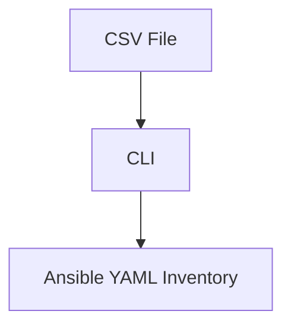

# Inventory Generator

Welcome to the Inventory Generator.
This tool converts a simple CSV file into structured YAML files that Ansible understands.

## Quickstart

```bash
# install dependencies
pip install -r requirements.txt

# generate inventory
python scripts/ansible_inventory_cli.py generate
```

For full usage and configuration, read the
[Installation](installation.md) and [Usage](usage.md) guides.


